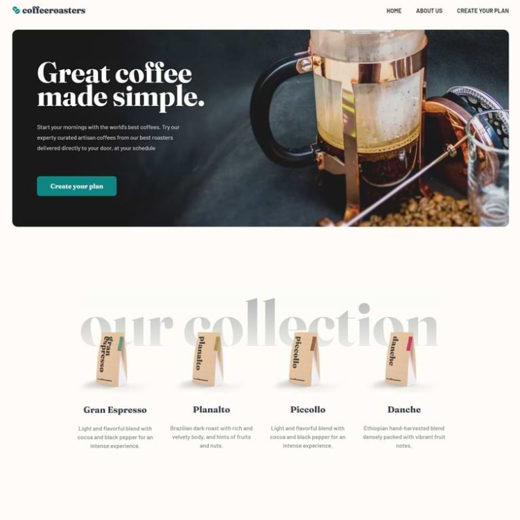
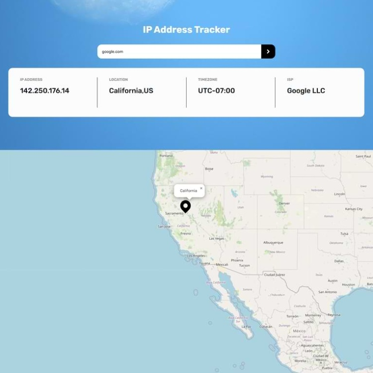
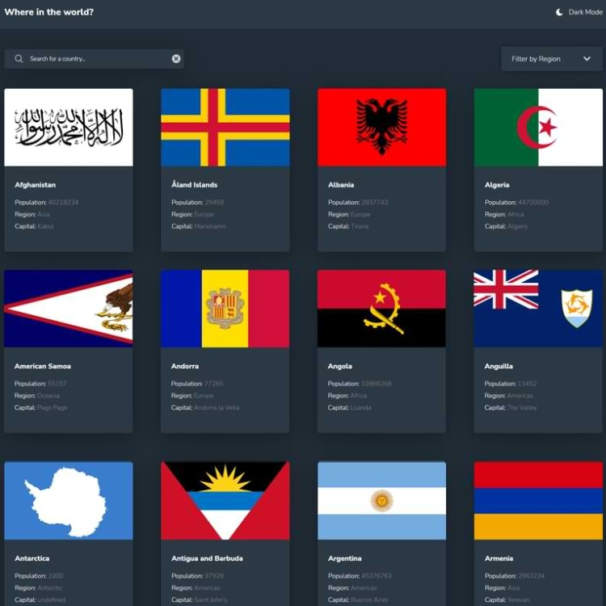

<h1 align="center">Hi 👋, I'm Natalia</h1>
<h3 align="center">A full stack web developer</h3>

- 🔭 I’m currently working on [Workspace](https://github.com/Abrosss/Workspace)

- 🌱 I’m currently learning **React**

<h1 align="center">PROJECTS</h1>
<table>
  
  <tr>
    <td width="50%" valign="top">
      <h3 align="center">Coffee Subscription Website</h3>
         
 
<strong>Javascript, SCSS, Node.js & Express.js</strong>

        
         
        

          
  <a href="https://github.com/Abrosss/coffee-shop" target="_blank">
 GITHUB
  </a>  
  <a href="http://coffee-sub.vercel.app/" target="_blank">
  LIVE
  </a>
      

        
Build a subscription plan that best fits your needs. Customize your order frequency, quantity, even your roast style and grind type.

    </td>
     <td width="50%" valign="top">
      <h3 align="center">URL Shortener</h3>
         
 
<strong>Javascript, SCSS, API</strong>

        
         
        

          
  <a href="https://github.com/Abrosss/Url-shortening-app" target="_blank">
 GITHUB
  </a>  
  <a href="https://magic-url-shortener.netlify.app/" target="_blank">
  LIVE
  </a>
      

        
Create shortened URLs

    </td>
  </tr>
    <tr>
    <td width="50%" valign="top">
      <h3 align="center">IP Address Tracker</h3>
         
 
<strong>Javascript, SCSS, API</strong>

        
         
        

          
  <a href="https://github.com/Abrosss/IP-TRACKER" target="_blank">
 GITHUB
  </a>  
  <a href="https://cool-ip-domain-tracker.netlify.app/" target="_blank">
  LIVE
  </a>
      

        
Track IP addresses or domains and view results on the map

    </td>
     <td width="50%" valign="top">
      <h3 align="center">Country Database</h3>
         
 
<strong>Javascript, SCSS, API</strong>

        
         
        

          
  <a href="https://github.com/Abrosss/FLAGS-API" target="_blank">
 GITHUB
  </a>  
  <a href="https://findacountrynowapi.netlify.app/" target="_blank">
  LIVE
  </a>
      

        
This app lets you learn about the countries of the world

    </td>
  </tr>

</table>

- 👨‍💻 Some of my frontend projects are available at [nessi.dev](https://nessi.dev)

<h3 align="left">Languages and Tools:</h3>

               

